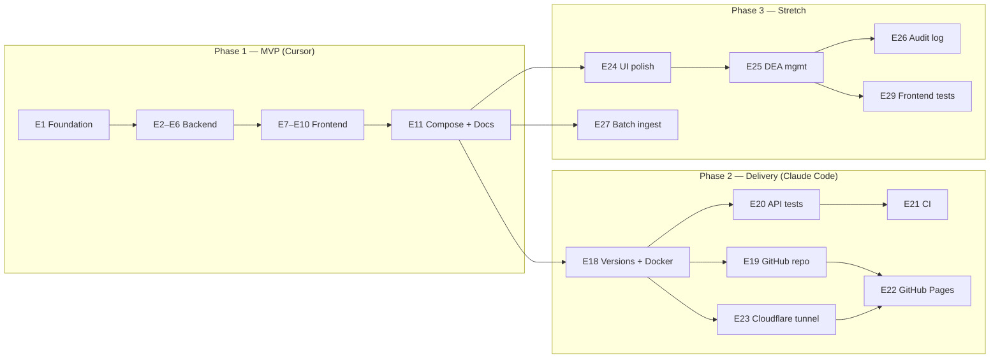
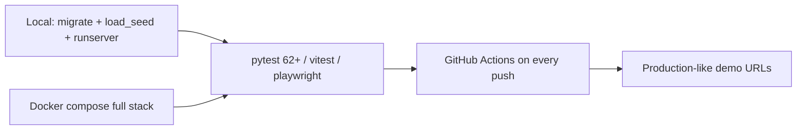

# How This Was Built — SureCost Drug Catalog

> A transparent walkthrough of how this take-home project was specified, built, evaluated, and delivered — including AI-assisted development.

---

## Epic timeline

The work splits into three phases: **MVP** (required epics E1–E11), **delivery & hardening** (E18–E23), and **stretch execution** (E24+, implementing deferred E12–E16).



---

## SDLC workflow

Every story follows the same gate defined in [`AGENTS.md`](../AGENTS.md):

```mermaid
flowchart TD
    SPEC["spec.md / spec_addendum*.md\n(story + depends_on + acceptance + verify)"]
    READY{All depends_on done?}
    IMPL[Implement in repo\n(backend/ or frontend/)]
    VERIFY[Run verify steps\npytest / lint / build / manual]
    AC{All acceptance_criteria met?}
    COMMIT[Conventional commit\nfeat: / fix: / test: / docs:]
    SDLC[Update traceability]
    DONE[Story Done]

    SPEC --> READY
    READY -->|no| WAIT[Wait / pick another story]
    READY -->|yes| IMPL
    IMPL --> VERIFY
    VERIFY --> AC
    AC -->|no| IMPL
    AC -->|yes| COMMIT
    COMMIT --> SDLC
    SDLC --> DONE
```

**Source of truth:** [`spec.md`](../spec.md) is immutable for the original MVP backlog. Post-MVP work was tracked in spec addenda; the stretch-execution backlog is [`spec_addendum_2.md`](../spec_addendum_2.md).

---

## Tools and agents

```mermaid
flowchart TB
    HUMAN[Human — product owner / reviewer]
    CURSOR[Cursor Composer / Auto\nMVP E1–E11]
    CLAUDE[Claude Code (self-hosted)\nE18–E23 delivery]
    AGENTS[Parallel sub-agents\nE24+ stretch]
    CI[GitHub Actions CI\nruff + pytest + eslint + build]
    LIVE[Live demo\napp.gaspartech.com + api.gaspartech.com]

    HUMAN -->|kickoff brief| CURSOR
    CURSOR -->|build session| MVP[MVP complete]
    HUMAN -->|delivery phase| CLAUDE
    CLAUDE -->|delivery session| DELIVERY[Pages + tunnel + dark mode]
    HUMAN -->|stretch phase| AGENTS
    AGENTS --> STRETCH[DEA + audit + batch + tests]
    MVP --> CI
    DELIVERY --> CI
    STRETCH --> CI
    DELIVERY --> LIVE
```

| Phase | Primary tool | Artifact |
|-------|--------------|----------|
| MVP (E1–E11) | Cursor Agent | Cursor build session |
| Delivery (E18–E23) | Claude Code (self-hosted) | delivery session log |
| Handoff | Documentation | internal handoff notes |
| Stretch (E24+) | Cursor sub-agents | [`spec_addendum_2.md`](../spec_addendum_2.md) |

---

## What AI did well / where humans verified

From [`AI_NOTES.md`](../AI_NOTES.md):

- **Worked well:** Following `spec.md` story order; Django ViewSet + django-filter patterns; TanStack Query + zod + react-hook-form integration.
- **Required human verification:** Idempotent `load_seed` (first version skipped all rows on re-run); NDC format and 109-record count; zod `transform()` + resolver TypeScript mismatches.
- **Version decision:** Kept Django 6.0.x (built and tested) rather than downgrading to 5.2 LTS; standardized on Python 3.12.

---

## Evaluation approach



The live demo intentionally uses an **open API** (no auth) for evaluator access. Production hosting options are documented separately in [Production Hosting](./PRODUCTION_HOSTING.md).

---

## Repository map (quick reference)

| Concern | Location |
|---------|----------|
| Build recipe | `spec.md`, `spec_addendum_2.md` |
| Operating rules | `AGENTS.md` |
| Backend API | `backend/drugs/` |
| Frontend UI | `frontend/src/` |
| Seed data (109 records) | `seed_drugs.json` |
| CI | `.github/workflows/ci.yml` |
| Pages deploy | `.github/workflows/pages.yml` |
