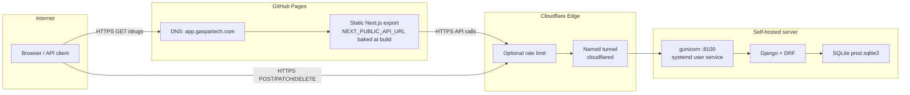
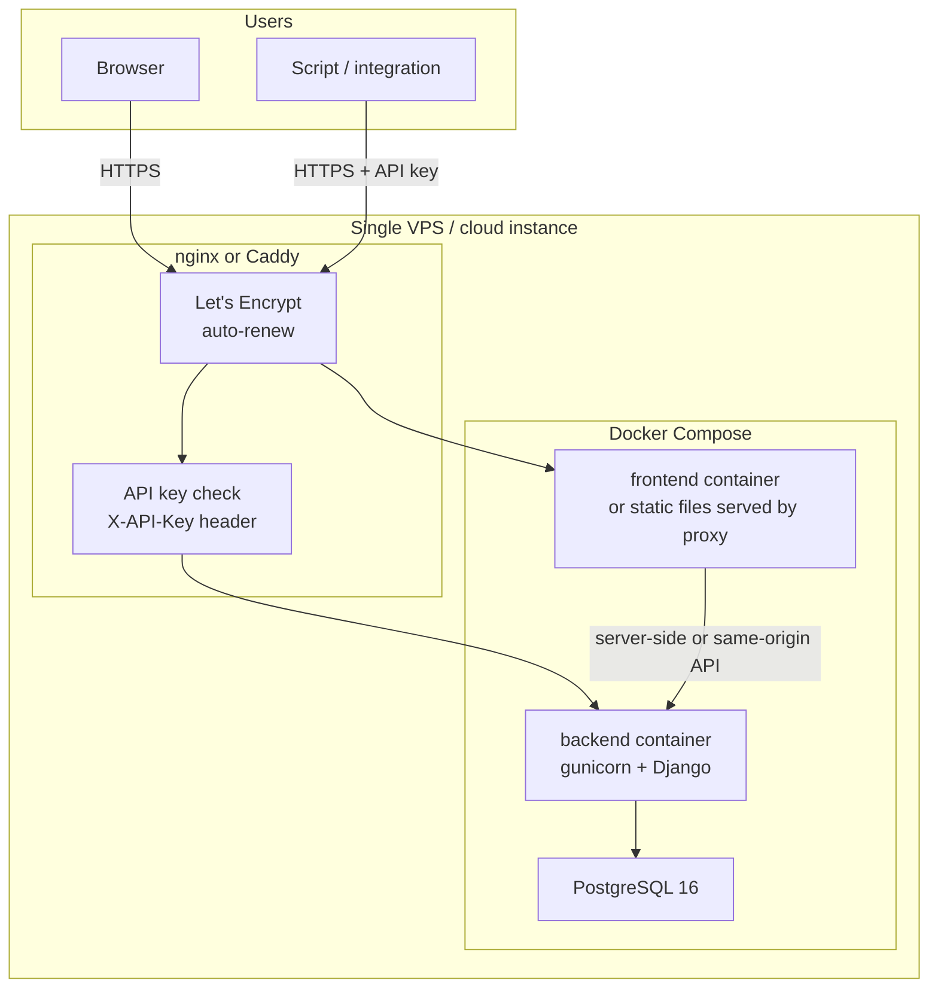
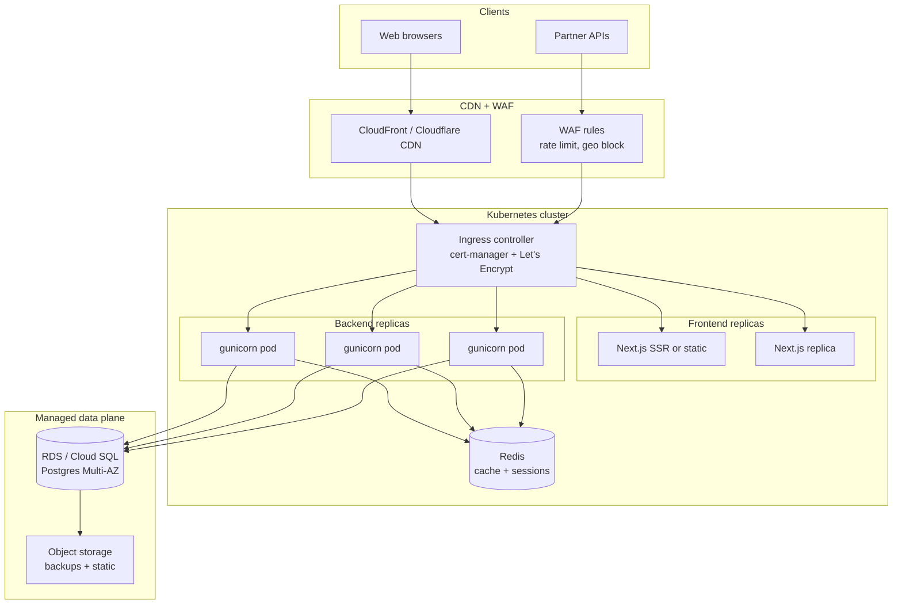
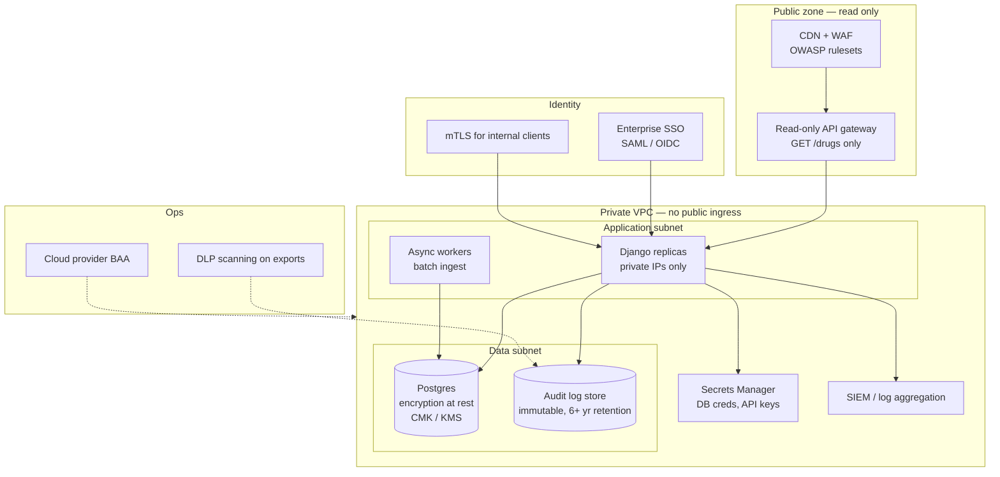
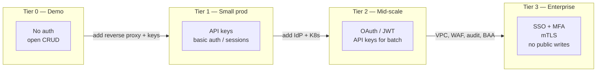

# Production Hosting Architecture — SureCost Drug Catalog

> **Purpose:** Describe how this application can be hosted at increasing scales and compliance levels. This document is **architecture guidance only** — it does not prescribe changes to the live demo stack.
>
> **Current live demo (June 2026):** Frontend at [app.gaspartech.com](https://app.gaspartech.com/drugs), API at [api.gaspartech.com](https://api.gaspartech.com/api/). The API is **intentionally open and unauthenticated** for evaluation purposes. Anyone with the URL can read, create, update, or delete drug records.

---

## Tier overview

| Tier | Name | Auth | Database | Availability | Monthly cost (order of magnitude) | Complexity |
|------|------|------|----------|--------------|-----------------------------------|------------|
| **0** | Current demo | None (open API) | SQLite on self-hosted node | Best-effort; single-node | ~$0 (existing hardware + free tiers) | Low |
| **1** | Small production | API keys or basic auth behind reverse proxy | PostgreSQL on same VPS | Single-node; manual failover | $20–80 (one VPS + domain) | Low–medium |
| **2** | Mid-scale | OAuth 2.0 / JWT + API keys for integrations | Managed RDS / Cloud SQL | Multi-replica; rolling deploys | $200–2,000+ | Medium–high |
| **3** | Enterprise / HIPAA | mTLS + SSO (SAML/OIDC); no public write API | Managed Postgres with encryption at rest | Multi-AZ, autoscaling, CDN | $2,000–20,000+ | High |

---

## Tier 0 — Current demo architecture

The live demo splits frontend and backend across two hosting surfaces connected by HTTPS and CORS. There is **no authentication layer** between the public internet and the Django REST API.

### Request flow

### Component summary

| Component | Technology | Notes |
|-----------|------------|-------|
| Frontend | GitHub Pages static export | Deployed by `.github/workflows/pages.yml` on push to `develop` |
| Frontend domain | `app.gaspartech.com` | CNAME in `frontend/public/CNAME` |
| API edge | Cloudflare named tunnel | `cloudflared` systemd service on the self-hosted server |
| API process | gunicorn on port 8100 | `surecost-backend.service` (systemd user unit) |
| Database | SQLite | Single-file `backend/prod.sqlite3`; not ideal for concurrent writes |
| CI | GitHub Actions | `ci.yml`: ruff, pytest (42 tests), eslint, build, Docker image build |
| Auth | **None** | All CRUD endpoints are public; documented in `README.md` and `AI_NOTES.md` |

### Auth approach

**Intentionally unauthenticated.** The demo prioritizes evaluator access over data protection. Write operations (`POST`, `PATCH`, `DELETE`) are exposed to anyone who discovers `api.gaspartech.com`. Mitigations for abuse are limited to optional Cloudflare rate limiting at the edge.

### Database choice

SQLite suits a single-process demo with low write concurrency. Docker Compose locally uses PostgreSQL (`docker-compose.yml`), but the live server uses SQLite for operational simplicity.

### Availability

- **Frontend:** High — GitHub Pages CDN is always on.
- **Backend:** Best-effort — depends on server uptime, gunicorn health, and tunnel connectivity. If the server reboots without the systemd service, the API is unreachable while the static UI may still load and show network errors.

### Cost and complexity tradeoffs

| Advantage | Limitation |
|-----------|------------|
| Near-zero incremental hosting cost | No SLA; single point of failure (single node) |
| Fast to stand up for a take-home demo | SQLite limits concurrent writers |
| No secrets management overhead for API auth | Open write API is unsuitable for real PHI or production catalog data |
| CI and Pages are free for public/private repos | `NEXT_PUBLIC_API_URL` is build-time — API domain changes require redeploy |

---

## Tier 1 — Small production (single VPS)

A single cloud VM or VPS runs the full stack behind a reverse proxy with TLS termination, PostgreSQL, and API key authentication.

### Auth approach

- **Human users (UI):** Session cookies via Django auth, or HTTP basic auth behind the proxy for a small internal team.
- **Programmatic clients:** Per-client API keys validated at the reverse proxy (nginx `map`) or in DRF middleware (`APIKeyAuthentication`). Keys stored in environment variables or a `.env` file on the host — not in git.
- **Admin:** Django admin behind the same proxy with separate credentials.

### Database choice

**PostgreSQL** on the same host (Compose service) or a small managed instance (e.g. RDS `db.t4g.micro`, DigitalOcean Managed DB). Migrations and `load_seed` run at container start via `entrypoint.sh`. Backups: nightly `pg_dump` to object storage.

### Availability

Single node. Expect **99%–99.5%** with a reputable VPS provider and automated restart policies (`restart: unless-stopped`). No multi-AZ redundancy. Planned maintenance requires a brief outage or blue/green manual swap.

### Cost and complexity tradeoffs

| Item | Estimate |
|------|----------|
| VPS (2 vCPU, 4 GB RAM) | $20–40/mo |
| Managed Postgres (optional) | +$15–30/mo |
| Domain + DNS | ~$12/yr |
| Operational effort | 2–4 hrs/mo (patches, cert renewals, backups) |

**When to choose:** Internal pharmacy catalog, pilot with &lt;50 concurrent users, no HIPAA BAA requirement, team comfortable operating one server.

---

## Tier 2 — Mid-scale

Horizontal scaling with container orchestration, managed database, optional Redis cache, and CDN for static assets.

### Auth approach

- **UI:** OAuth 2.0 / OpenID Connect (Auth0, Cognito, or Keycloak) with role-based access (viewer, editor, admin).
- **API:** JWT bearer tokens (short-lived) plus long-lived API keys for batch integrations. Keys rotated via secrets manager.
- **Service-to-service:** mTLS between ingress and backend pods where required.

### Database choice

**Managed PostgreSQL** (AWS RDS, GCP Cloud SQL, Azure Database for PostgreSQL) with automated backups, point-in-time recovery, and read replicas for reporting queries. Redis optional for session storage, filter dropdown caching, and rate-limit counters.

### Availability

- **Target:** 99.9%–99.95% with multi-replica deployments, health checks, and rolling updates.
- **CDN** serves static export or SSR assets globally.
- **Database** Multi-AZ failover for the primary.

### Cost and complexity tradeoffs

| Item | Estimate |
|------|----------|
| Managed K8s (EKS/GKE/AKS) | $150–400/mo cluster fee + nodes |
| RDS (db.r6g.large Multi-AZ) | $200–600/mo |
| CDN + WAF | $50–200/mo |
| Redis (ElastiCache) | $50–150/mo |
| DevOps / SRE time | Significant — IaC, monitoring, on-call |

**When to choose:** Multi-site pharmacy operations, hundreds of concurrent users, need for zero-downtime deploys, integration partners calling the API at volume.

---

## Tier 3 — Enterprise / HIPAA-oriented

Architecture for regulated healthcare data: private networking, encryption everywhere, audit retention, WAF, BAA-covered cloud services, and **no public write API**.

### Auth approach

- **No anonymous or public write access.** `POST`, `PATCH`, and `DELETE` are reachable only from private networks or authenticated admin tooling (VPN, bastion, or internal service mesh).
- **Staff UI:** Enterprise SSO with MFA; RBAC maps to Django groups (read-only pharmacist vs. catalog administrator).
- **Integrations:** mTLS client certificates or signed service accounts; batch ingest via internal queue, not a public REST endpoint.
- **Audit:** Every mutation logged immutably (aligns with stretch epic E13 — `AuditLog` model); actor, timestamp, field-level diff.

### Database choice

- **PostgreSQL** on HIPAA-eligible managed service with encryption at rest (KMS-managed keys), encryption in transit (TLS 1.2+), automated backups with cross-region replication.
- **Audit log** in append-only storage (S3 Object Lock, dedicated audit table with no `UPDATE`/`DELETE` grants).
- **SQLite is not acceptable** at this tier.

### Availability

- Multi-AZ, multi-region disaster recovery for RPO/RTO targets defined by compliance policy.
- WAF with managed rule groups, DDoS protection, and geo-fencing.
- 99.99% design target with formal incident response and change management.

### Cost and complexity tradeoffs

| Requirement | Impact |
|-------------|--------|
| BAA with cloud provider | Limits provider choice (AWS, GCP, Azure healthcare programs) |
| VPC-only backend | Higher networking and VPN/bastion operational cost |
| Audit retention (6+ years) | Storage and query costs grow over time |
| Penetration testing, SOC 2 | External audit fees, policy documentation |
| Secrets rotation | Automation required; no env files on disk |

**When to choose:** Handling PHI or data governed by HIPAA, state pharmacy boards, or enterprise procurement requiring BAAs, encryption attestations, and formal access controls.

---

## Cross-tier comparison: authentication options

| Mechanism | Tier 0 | Tier 1 | Tier 2 | Tier 3 |
|-----------|--------|--------|--------|--------|
| None (open API) | ✅ Current | ❌ | ❌ | ❌ |
| API key (`X-API-Key`) | — | ✅ | ✅ | ✅ (internal only) |
| Session / Django auth | — | ✅ | ✅ | ✅ |
| OAuth 2.0 / OIDC | — | Optional | ✅ | ✅ (SSO) |
| mTLS | — | — | Optional | ✅ |
| Public write endpoints | ✅ | ⚠️ Restrict | ⚠️ Restrict | ❌ |

---

## Migration path from current demo

1. **Immediate hardening (no code deploy):** Enable Cloudflare rate limiting on `api.gaspartech.com`; restrict `POST`/`DELETE` by path at the edge if read-only demo is sufficient.
2. **Small production:** Move backend to a VPS; switch `DATABASE_URL` to PostgreSQL; add nginx/Caddy with Let's Encrypt; implement DRF `APIKeyAuthentication` for write operations.
3. **Mid-scale:** Containerize with existing Dockerfiles; deploy to Kubernetes; adopt managed RDS; add Redis for cache; move frontend to CDN-backed static or SSR hosting.
4. **Enterprise:** Place backend in private subnets; enable encryption at rest; implement audit log (E13); sign BAA; remove public write routes from the internet-facing gateway.

---

## Related documents

| Document | Relevance |
|----------|-----------|
| [`AI_NOTES.md`](../AI_NOTES.md) | Rationale for open API on the demo |
| [`docker-compose.yml`](../docker-compose.yml) | Reference Postgres + full-stack layout for Tier 1 |
| [`spec.md`](../spec.md) | API contract and domain invariants (unchanged across tiers) |

---

*Document produced for epic E30. The live demo remains intentionally unauthenticated until an operator explicitly deploys a higher tier.*
